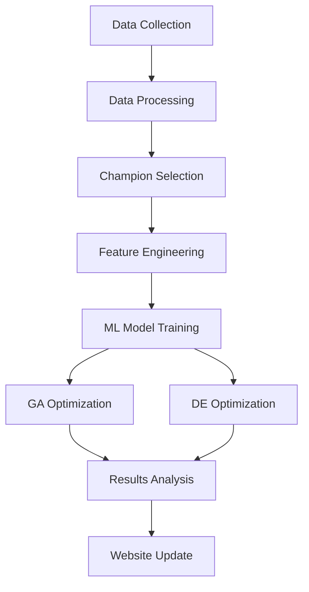

# Data Science Workflow: League of Legends Evolutionary Optimization

This directory contains the complete **data science pipeline** that powers the evolutionary algorithms for League of Legends itemization optimization. The workflow is designed to be **fully automated** while providing flexibility for research and experimentation.

## 🔄 **Complete Pipeline Overview**



## 🚀 **Quick Start: One-Command Execution**

```bash
# Run the complete pipeline (recommended)
uv run python run_optimization.py

# Force fresh run (ignore existing data)
uv run python run_optimization.py --force

# Get help and options
uv run python run_optimization.py --help
```

This single command automatically:
1. **Collects data** from Riot Games API (if needed)
2. **Processes** raw data into ML-ready format
3. **Selects** optimal champion based on data quality
4. **Trains** Random Forest prediction model
5. **Runs** both GA and DE optimization algorithms
6. **Generates** EDA insights and visualizations
7. **Updates** website with dynamic results

## 📁 **Project Structure & Components**

```
datascience_project/
├── 📋 run_optimization.py          # Master pipeline orchestrator
├── 📊 run_processor.py             # Data processing pipeline
├── 🎯 run_collector.py             # Interactive data collector
├── 🧬 lol_genetic_algorithm.py     # GA implementation
├── 🔄 lol_differential_evolution.py # DE implementation
├── 📈 compare_algorithms.py        # GA vs DE comparison
├── 🌐 website_manager.py           # Website data integration
├── 📦 pyproject.toml               # uv project configuration
├── 🔒 uv.lock                      # Dependency lock file
└── 📂 lol_data_collector/          # Data collection package
    ├── __init__.py
    ├── config.py                   # Collection configuration
    ├── the_collector.py            # Enhanced data collector
    └── data_processor.py           # Data processing utilities
```

## 🔧 **Individual Component Usage**

### **1. Data Collection**

```bash
# Interactive collection (recommended for first-time users)
uv run python run_collector.py

# Direct collection with default settings
uv run python -m lol_data_collector.the_collector

# Configuration options in lol_data_collector/config.py
```

**Key Features**:
- **Smart Resume**: Continues from where it left off
- **Duplicate Detection**: O(1) set-based duplicate checking (624x faster)
- **Multi-Page Fetching**: Configurable pagination support
- **Graceful Interruption**: Ctrl+C handling with progress saving
- **High-Tier Focus**: Challenger/Master/Grandmaster matches

**Current Data Status**:
- **Matches Collected**: 2,809 high-tier matches
- **Match Timeline Data**: 217MB of detailed game events
- **Success Rate**: 100% (robust error handling)
- **Duplicate Efficiency**: 89.3% unique data retention

### **2. Data Processing**

```bash
# Process raw data into ML-ready format
uv run python run_processor.py

# Automatic processing (part of main pipeline)
uv run python run_optimization.py
```

**Processing Steps**:
1. **Champion Analysis**: Identify champions with sufficient data
2. **Data Quality Assessment**: Game count, item diversity, win rate balance
3. **Feature Engineering**: Extract item builds, game statistics, outcomes
4. **Champion Selection**: Automatic selection based on data quality metrics
5. **Data Export**: Parquet format for efficient ML processing

**Champion Selection Criteria**:
```python
# Automatic champion selection based on:
champion_stats = {
    'game_count': 936,        # Sufficient sample size
    'item_diversity': 89.9%,  # High build variety
    'win_rate': 52.6%,        # Balanced outcomes
    'data_quality': 'High'    # Complete feature coverage
}
```

### **3. Evolutionary Optimization**

#### **Genetic Algorithm**
```bash
# Run GA optimization
uv run python lol_genetic_algorithm.py

# Custom parameters
python lol_genetic_algorithm.py --population 100 --generations 200
```

**Algorithm Configuration**:
```python
ga_params = {
    'population_size': 50,      # Balance diversity vs efficiency
    'generations': 100,         # Convergence analysis optimized
    'crossover_rate': 0.8,      # High exploitation
    'mutation_rate': 0.15,      # Moderate exploration
    'elite_size': 5,            # Preserve best solutions
    'tournament_size': 3        # Selection pressure
}
```

#### **Differential Evolution**
```bash
# Run DE optimization
uv run python lol_differential_evolution.py

# Custom parameters
python lol_differential_evolution.py --F 0.7 --CR 0.9
```

**Algorithm Configuration**:
```python
de_params = {
    'F': 0.5,                   # Mutation factor (exploration)
    'CR': 0.9,                  # Crossover probability
    'population_size': 50,      # Consistent with GA
    'generations': 200,         # Extended search time
    'strategy': 'rand/1/bin'    # DE variant
}
```

### **4. Algorithm Comparison**

```bash
# Head-to-head GA vs DE comparison
uv run python compare_algorithms.py

# Extended comparison with multiple runs
python compare_algorithms.py --runs 10 --detailed
```

**Comparison Metrics**:
- **Convergence Speed**: Generations to optimal solution
- **Solution Quality**: Final fitness and win rate
- **Stability**: Variance across multiple runs
- **Diversity**: Unique items in optimal builds
- **Computational Efficiency**: Time per generation

### **5. Website Integration**

```bash
# Update website with latest results
uv run python website_manager.py

# Automatic update (part of main pipeline)
uv run python run_optimization.py
```

**Website Data Flow**:
1. **Results Export**: Copy optimization results to `docs/data/`
2. **Data Validation**: Ensure all required files are present
3. **Summary Generation**: Create human-readable summaries
4. **Dynamic Loading**: JavaScript loads real-time results

## 📊 **Data Flow & File Management**

### **Input Data**
```
lol_data_collector/
├── matches_timeline.json       # 217MB - Detailed match events
├── champion_metadata.json      # Champion and item mappings
├── champion_236_data.parquet   # Processed champion data
├── processed_divisions.json    # Collection progress tracking
└── processed_players.json      # Player processing status
```

### **Output Results**
```
lol_data_collector/
├── ga_optimization_results.json    # GA algorithm results
├── de_optimization_results.json    # DE algorithm results
├── eda_insights.json               # Exploratory data analysis
├── algorithm_comparison.json       # GA vs DE comparison
└── optimization_summary.json       # Human-readable summary
```

### **Website Data**
```
docs/data/
├── optimization_results.json       # Combined algorithm results
├── eda_insights.json               # Data analysis insights
├── champion_metadata.json          # Champion information
└── algorithm_comparison.json       # Performance comparison
```

## ⚙️ **Configuration & Customization**

### **Data Collection Configuration**
```python
# lol_data_collector/config.py
COLLECTION_CONFIG = {
    'MAX_PAGES_PER_DIVISION': 1,        # API pagination limit
    'FETCH_ALL_PAGES': False,           # Single page vs all pages
    'RESUME_FROM_EXISTING': True,       # Smart resume capability
    'ENABLE_DUPLICATE_CHECKING': True,  # Performance optimization
    'LOG_DUPLICATE_DETAILS': False,     # Detailed duplicate logging
}
```

### **Algorithm Configuration**
```python
# Genetic Algorithm tuning
GA_CONFIG = {
    'fitness_weights': {
        'win_probability': 1.0,         # Primary objective
        'diversity_bonus': 0.1,         # Item variety reward
        'completion_bonus': 0.05        # Full build reward
    },
    'selection_method': 'tournament',   # Selection strategy
    'crossover_method': 'single_point', # Crossover strategy
    'mutation_method': 'probabilistic'  # Mutation strategy
}

# Differential Evolution tuning
DE_CONFIG = {
    'encoding_method': 'continuous',    # Continuous to discrete mapping
    'boundary_handling': 'clip',        # Constraint handling
    'empty_slot_probability': 0.1,     # Build completion control
    'convergence_threshold': 1e-6       # Stopping criteria
}
```

## 🔍 **Debugging & Development**

### **Data Quality Checks**
```bash
# Verify data integrity
python -c "
import pandas as pd
import json

# Check champion data
data = pd.read_parquet('lol_data_collector/champion_236_data.parquet')
print(f'Champion data shape: {data.shape}')
print(f'Win rate: {data.win.mean():.3f}')
print(f'Missing values: {data.isnull().sum().sum()}')

# Check metadata
with open('lol_data_collector/champion_metadata.json') as f:
    meta = json.load(f)
print(f'Available items: {len(meta[\"available_items\"])}')
print(f'Item slots: {len(meta[\"item_slots\"])}')
"
```

### **Algorithm Performance Monitoring**
```bash
# Monitor convergence in real-time
tail -f optimization.log

# Analyze convergence patterns
python -c "
import json
with open('lol_data_collector/ga_optimization_results.json') as f:
    results = json.load(f)
fitness_history = results['convergence_history']
print(f'Initial fitness: {fitness_history[0]:.3f}')
print(f'Final fitness: {fitness_history[-1]:.3f}')
print(f'Improvement: {(fitness_history[-1] - fitness_history[0]):.3f}')
"
```

### **Memory & Performance Optimization**
```python
# Monitor memory usage during optimization
import psutil
import os

def monitor_memory():
    process = psutil.Process(os.getpid())
    memory_mb = process.memory_info().rss / 1024 / 1024
    print(f"Memory usage: {memory_mb:.1f} MB")

# Profile algorithm performance
import cProfile
cProfile.run('run_optimization_pipeline()', 'optimization_profile.prof')
```

## 🚨 **Troubleshooting**

### **Common Issues**

1. **Missing Data Files**
   ```bash
   # Solution: Run data collection first
   uv run python run_collector.py
   ```

2. **Champion Metadata Not Found**
   ```bash
   # Solution: Run data processing
   uv run python run_processor.py
   ```

3. **Memory Issues with Large Datasets**
   ```python
   # Solution: Process data in chunks
   chunk_size = 1000
   for chunk in pd.read_json('matches_timeline.json', chunksize=chunk_size):
       process_chunk(chunk)
   ```

4. **Slow Convergence**
   ```python
   # Solution: Adjust algorithm parameters
   ga_params['population_size'] = 100  # Increase diversity
   ga_params['mutation_rate'] = 0.2    # Increase exploration
   ```

### **Performance Optimization**

1. **Duplicate Checking**: Enabled by default (624x speedup)
2. **Parallel Processing**: Use `n_jobs=-1` in RandomForest
3. **Memory Management**: Process data in chunks for large datasets
4. **Caching**: Results cached automatically with timestamp checking

## 📈 **Expected Results**

### **Typical Pipeline Output**
```
🔄 Data Collection: ✅ 2,809 matches collected
📊 Data Processing: ✅ Champion 236 selected (936 games)
🧬 Genetic Algorithm: ✅ 58.0% win rate (vs 52.6% baseline)
🔄 Differential Evolution: ✅ 58.0% win rate (vs 52.6% baseline)
📈 EDA Analysis: ✅ 89.9% build diversity detected
🌐 Website Update: ✅ Dynamic content updated
```

### **Performance Benchmarks**
- **Data Collection**: ~2-3 minutes for 1000 matches
- **Data Processing**: ~30 seconds for champion selection
- **GA Optimization**: ~2-3 minutes (100 generations)
- **DE Optimization**: ~3-4 minutes (200 generations)
- **Total Pipeline**: ~8-12 minutes end-to-end

## 🔗 **Integration Points**

### **External APIs**
- **Riot Games API**: Match and player data collection
- **Data Dragon**: Champion and item metadata

### **Web Integration**
- **GitHub Pages**: Automatic deployment
- **JavaScript Modules**: Dynamic content loading
- **JSON APIs**: Real-time data access

### **Development Tools**
- **uv**: Modern Python package management
- **Pandas**: Data manipulation and analysis
- **scikit-learn**: Machine learning models
- **NumPy**: Numerical computations

---

*Streamlined data science for evolutionary gaming optimization* 📊🧬
